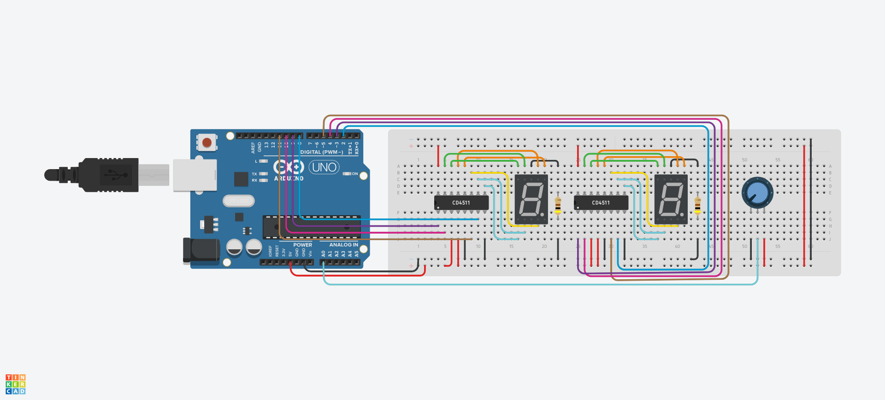

# R3 Software Task 1


The link to the board on [TinkerCAD](https://www.tinkercad.com/things/ivgo4v7VrjE).

<br>

## Hardware

The Arduino powers both `CD4511` display driver chips with 5v. Each display chip is wired to a `7 segment LCD`. The Arduino is connected to a potentiometer and reads its voltage from analog pin 0. The value read from the analog pin is then interpreted in software then sends out a signal to pins 2-5 and 8-11. The Arduino controls the displays using digital pins 2-5 to control the right LCD, and uses pins 8-11 to control the left LCD. The LCDs are common cathode displays. Each `CD4511`'s a-g pins are wired to their respective a-g `7 segment LCD` pins. The common pin (pin 8) is wired to a 400 Ω resistor which is then grounded. 


<br>

## Software

When the Arduino first receive power, it runs the function `setup` which takes note of the Arduino pins used. After the `setup` function finishes, the `loop` function runs indefinitely. Inside `loop` the voltage from analog pin 0 (`ANALOG_PIN`) is read.
```ino
analog_data = analogRead(ANALOG_PIN);
```
The potentiometer gives a variable value, that is `analog_data`, which ranges from 0 to 1023. This variable is then scaled by a factor of 10.23 (`SCALE_FACTOR`) which then makes the input range from 0 to 100 (`scaled_data`).
```ino
double scaled_data = (double)analog_data / SCALE_FACTOR;
```
We do not have to worry about values larger than 100 because the `SCALE_FACTOR` makes sure we never get any number bigger than 100. Since the 2 displays can not show a 3 digit number, if the input value is 100 make it equal to 99.
```ino
if (scaled_data == 100)
{
    scaled_data = 99;
}
```
Now split the digits of `scaled_data` into two separate variables (`ones_digit` & `tens_digit`) using the function `split_digit`. Each digit is then displayed using the function `to_display`. The `to_display` function takes a digit created from `split_digit` and the 4 pins you want to send the signal to as parameters. This function is run twice, once for each display.
```ino
void to_display(int num, int pin_1, int pin_2, int pin_3, int pin_4)
{
	switch (num)
	{
	case DPY_1:
		digitalWrite(pin_1, HIGH);
		digitalWrite(pin_2, LOW);
		digitalWrite(pin_3, LOW);
		digitalWrite(pin_4, LOW);
		break;
    ...
```

<br>

## Reflection

This is my first time using an Arduino and programming in Arduino Programming Language \**cough*\* C++ *\*Ahm\**. I don't know C++ so I just wrote code as if it was C (and it worked!). The code controls both displays separately, however its possible to wire the displays in a way such that when the first displays passes 9 the next display increments by 1, I don't know how to do that though. I had some difficulty deciding how to control the displays because I think its probably possible to use a series of binary operations to control what LEDs are on within a display. If it's possible it would simplify the long switch statement in the `to_display` function. 